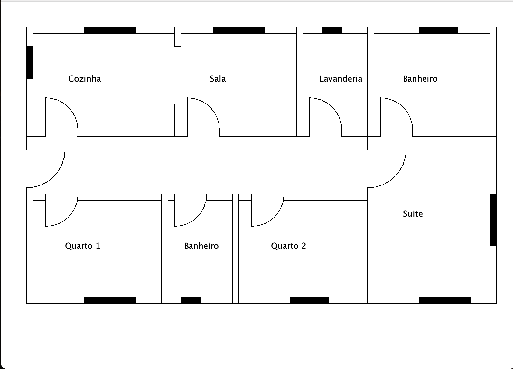

## Planta Baixa Swing

O projeto foi uma atividade de POO.

No projeto foi utilizada a biblioteca, Swing, nativa do java.

E foi também aplicado os conceitos basicos de orientação a objetos

Foto do projeto:
